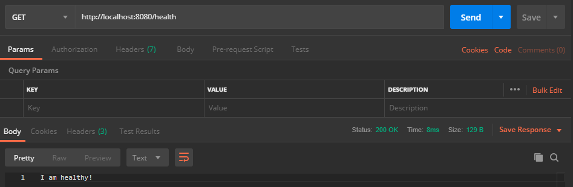
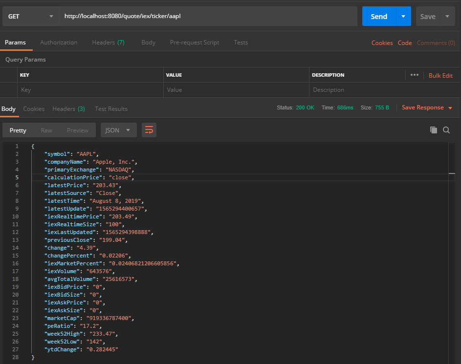
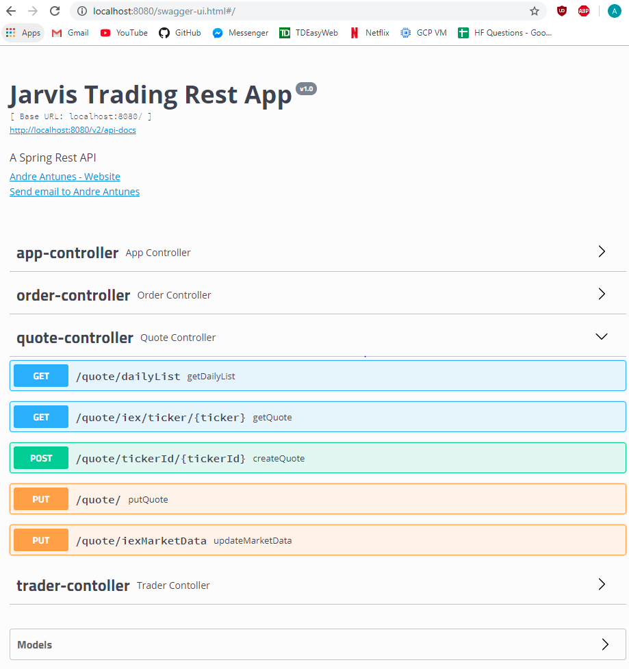
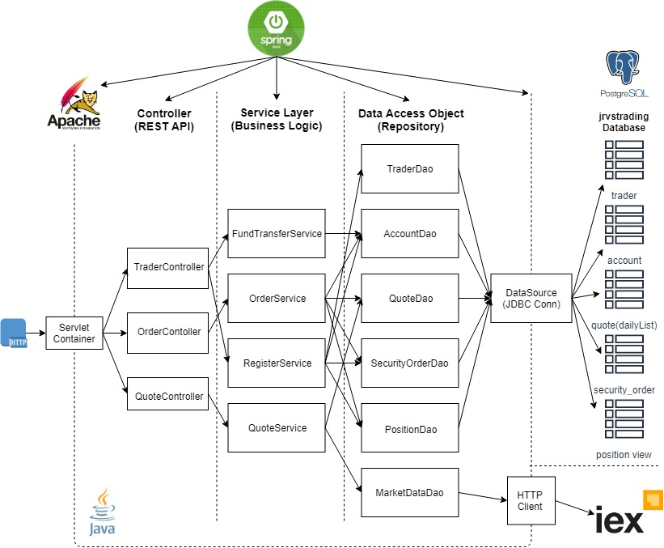

# Introduction

- The Trading App is a http based stock trading REST API to simulate the stock market by allowing a user to view stock quotes, buy or sell stocks, maintain their account balance and stock position. This application receives fresh market data and uses `CRUD` operations to store stock quotes, accounts, traders, positions and security orders. The applications main purpose is to educate users on the basics of the stock market through a test environment. 
- This Micro Service uses `SpringBoot` to launch and configure application dependencies. `Swagger UI` is used to test all end-points. Market Data is received through http requests to `IEX Cloud`.  All data is persisted to a `PSQL` Database.

# Quick Start

- Prequiresites: Java, Docker, CentOS 7

- PSQL init - The database is initialized by running the following script `run_trading_app`. It starts docker, initializes the database and populates it with the necessary tables used in the application.

- Git clone and maven build

- Start the SpringBoot app by running the shell script `/Shell_Scripts/run_trading_app.sh`. After which, the application is accessible by using the Swagger UI or through the Postman app. To use Postman, the user must first download the app and run http requests through `http://localhost:8080/` followed by the operation path.

  - i.e. `http://localhost:8080/quote/iex/ticker/aapl` 







  To use Swagger UI, open the following link in your browser to be redirected to the swagger-ui of the application. 

  - i.e. `http://localhost:8080/swagger-ui.html`




    This application also needs several environment variables to run. These include:

  ```
  IEX_PUB_TOKEN=your_iex_token
  PSQL_USER=postgres
  PSQL_PASSWORD=password
  PSQL_URL=jdbc:postgresql://localhost:5432/jrvstrading
  IEX_HOST=https://cloud.iexapis.com/stable
  ```


# REST API Usage

## Swagger

Swagger is an open-source software framework backed by a large ecosystem of tools that helps developers design, build, document, and consume RESTful Web services. API design is prone to errors, and it’s extremely difficult and time-consuming to spot and rectify mistakes when modeling APIs thus using swagger simplify the job of developer who can test their endpoints using swagger graphical user interface (GUI).

## Quote Controller

- Quote Controller is designed to preform `CRUD` operations such as `Create` ,`Read` and `Update` quote related information.  Market data quotes are retrieved from `IEX Cloud` using http requests and is cached into the `quote` table in the `jrvstrading` database using JDBC connections.
- The endpoints for this controller are as follows:
  - GET `/quote/dailyList`: list all securities that are available to trading in this trading system
  - GET `/quote/iex/ticker/{ticker}`: Returns a IEX Quote with given ticker from IEX Cloud
  - PUT `/quote/iexMarketData`: Update all quotes from IEX which is an external market data source
  - POST `/quote/tickerId/{tickerId}`: Add a new ticker to the dailyList (quote table)
  - PUT `/quote/`: Update a given quote in the quote table

## Trader Controller

- Trader Controller is designed to preform `CRUD` operations such as `Create`, `Update` and `Delete` to manage trader and account information. This controller can also deposit or withdraw money from a given users account. 

- The endpoints for this controller are as follows:

  - DELETE `/trader/traderID/{traderId}`: Deletes a trader if the account balance is zero and no position associated with the account are open. This endpoint simultaneously deletes the associated account and security order
  - POST `/trader/}`: Creates a trader and an account with DTO
  - POST `/trader/firstname/{firstname}/lastname/{lastname}/dob/{dob}/country/{country}/email/{email}`: Create a trader and an account
  - PUT `/trader/deposit/traderId/{traderId}/amount/{amount}`: Deposit a fund to user account
  - PUT `/trader/withdraw/traderId/{traderId}/amount/{amount}`: Withdraw a fund to user account so long as withdrawn amount is not greater than account balance

  

## Order Controller

- Order Controller is used to buy or sell stock for a trader given a ticker.

- The endpoint for this controller is:

  - POST `/order/marketOrder`: MarketOrder is a `JSON POGO` that contains `accountId`, `size` and `ticker`.

  

## App controller

- App Contoller is used to check the status of the application
- The endpoint for this controller is:
  - GET `/health`: makes sure SpringBoot app is up and running


# Architecture

- Trading Application Workflow




  - `Controller` : Parse user inputs and then calls the corresponding service method.
  - `Service` : This component is knows as Business logic. In computer software a business logic is the part of program that encodes the real-world` business rules` that determines how data can be created, stored and changed.`Business Rules` describe the operation, definitions and constraints that apply to an organization.
  - `Dao` : Data Access Object which handles various object. DAO is used to map the retrieved information from `IEX Cloud` and then latter use it to persist data into `PSQL` database.
  - `SpringBoot: webservlet/TomCat and IoC` : Spring Boot makes it easy to create stand-alone, production-grade Spring based Applications that you can "just run".
  - `PSQL` - PostgrSQL, also know as postgres, is a free and open-source relational database management system `RDBMS`. It takes the information from DAO and store it into `PSQL` database using DataSouce (JDBC Connection).
  - `IEX` - Investors Exchange is a stock exchange based in United States. For this Application we use `IEX Cloud` is a flexible financial data platform connecting a wide array of developers with curated financial data. It also offers an API service, allowing developers to query US and Canadian Stock Data.

# Improvements

- Implement Dashboard Controller
- Allow trader to take on short position
- Automate `updateMarketData` such that quote list is updated frequently
- Implement notifications when stocks rise or drop by a certain amount
- Implement buy/sell marks when a stock rises or drops by a certain amount
